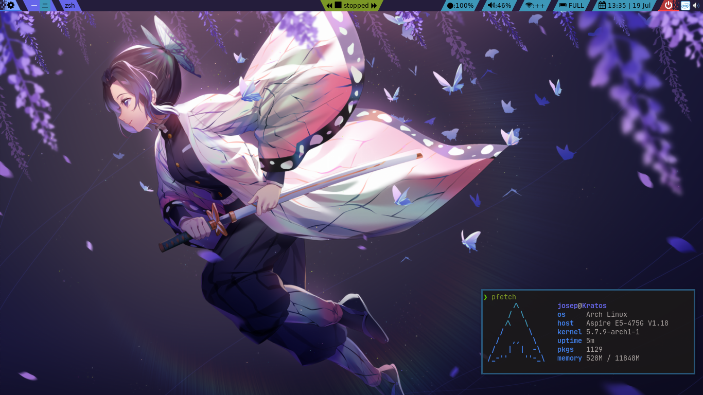
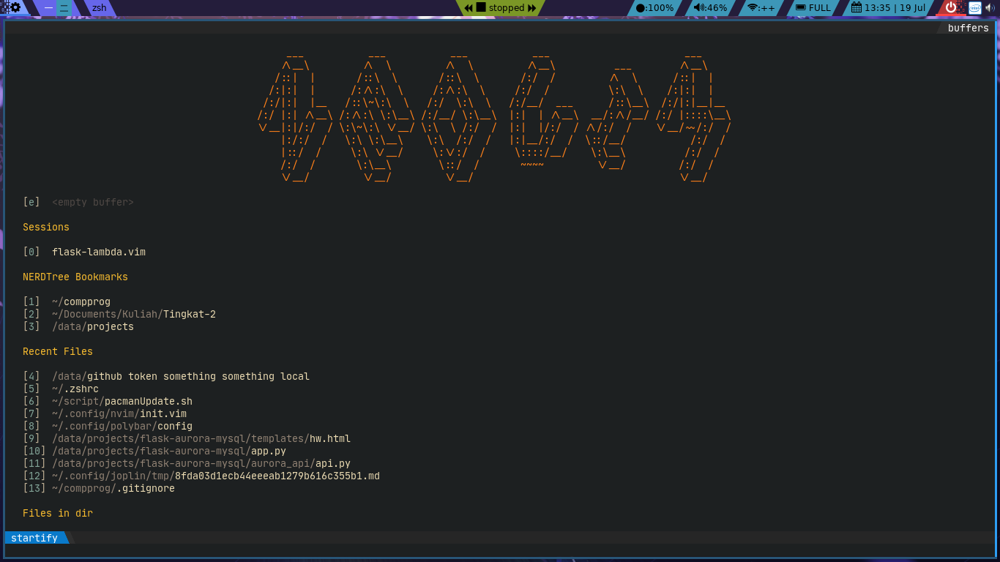
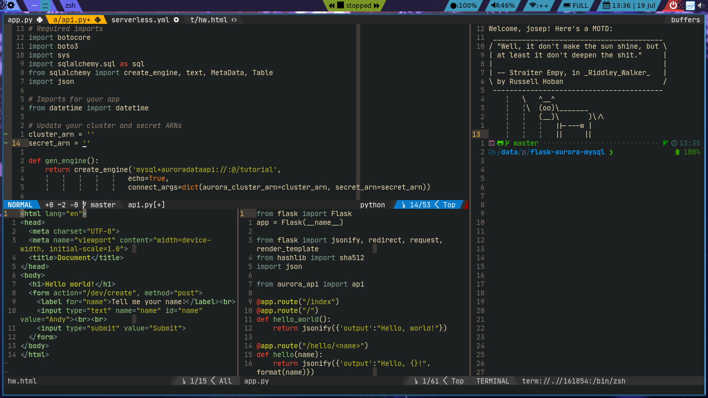
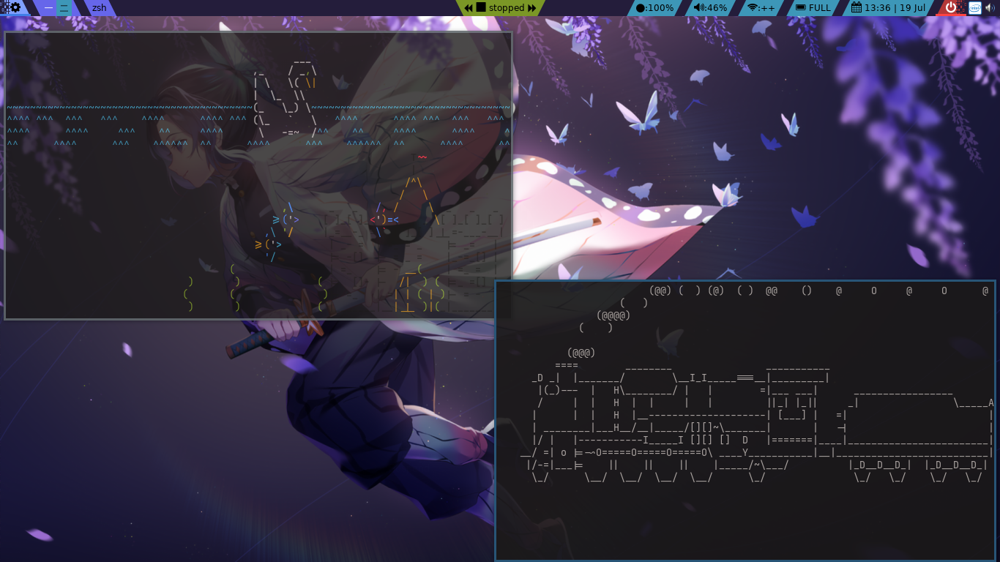

# My Dotfiles

This is a git bare repository to manage my dotfiles

You should clone [Powerlevel10k](https://github.com/romkatv/powerlevel10k) to your home directory for the zsh theme.

Tutorial: [Here](https://harfangk.github.io/2016/09/18/manage-dotfiles-with-a-git-bare-repository.html)

Thanks to [DistroTube](https://www.youtube.com/channel/UCVls1GmFKf6WlTraIb_IaJg) for introducing me to git bare

## Screenshots

